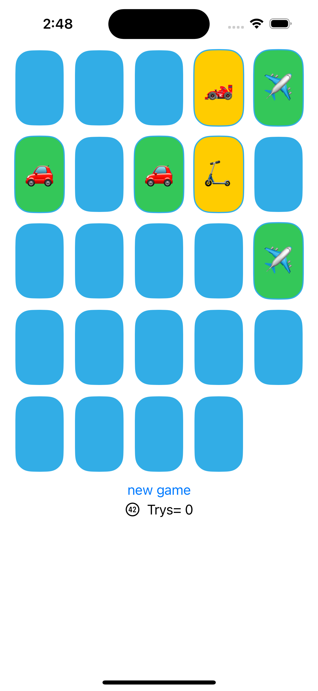

# 🚀 Memorize Game (SwiftUI)

A simple and fun memory card-matching game built using **SwiftUI**. This app is part of a learning journey into iOS development and SwiftUI concepts. Tap cards to flip and find matching emoji pairs!

## 📱 Features

- 🎴 Flip cards and match pairs of transportation-themed emojis.
- 🧠 Tracks number of card flips (tries).
- 🆕 "New Game" button (placeholder, logic can be expanded).
- 💡 Colored UI with random color themes per session.
- 🔁 Automatically reshuffles emojis each new game session.

## 🛠 Technologies Used

- Swift
- SwiftUI
- MVVM Architecture

## 📁 Project Structure

```

Memorize/
├── ContentView\.swift           # Main view with card grid and UI
├── MemoryGame.swift            # Game model logic (generic)
├── emojiMemoryGame.swift       # ViewModel and emoji-specific logic
├── MemorizeApp.swift           # App entry point

````

## 🧠 How It Works

- The model (`MemoryGame`) handles the core game logic (flipping, matching, tracking).
- The view model (`emojiMemoryGame`) bridges the model and the SwiftUI view, handling user interactions.
- The view (`ContentView`) displays the UI and reacts to game state changes using `@ObservedObject`.

## 🎨 Screenshots

<p float="left">
  
</p>

## 🔄 To Do

- Add actual functionality to the "New Game" button.
- Improve UI feedback for matched/unmatched cards.
- Add animations.
- Add sound or haptic feedback.
- Support for more themes or categories.

## ✅ Getting Started

1. Clone this repo:
   ```bash
   git clone https://github.com/yourusername/Memorize.git


2. Open in **Xcode**.
3. Run on Simulator or your device.

## 🧑‍💻 Author

**Rida Mansour**

Feel free to fork, clone, and modify this project. Contributions are welcome!

---
